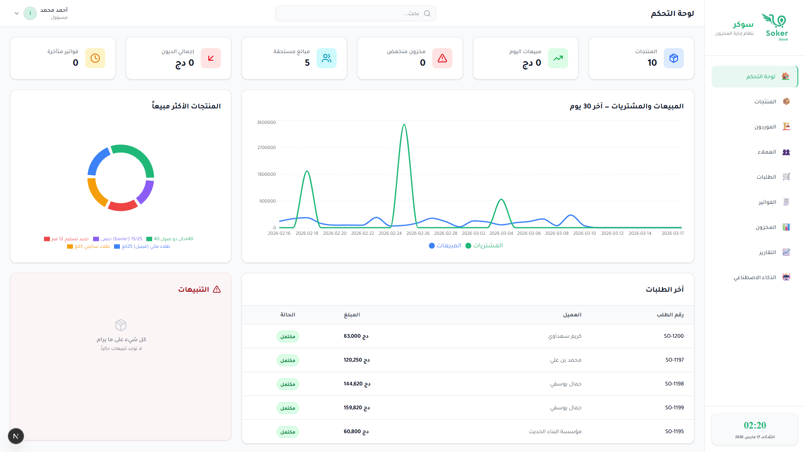
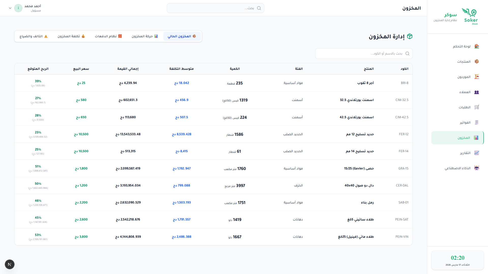
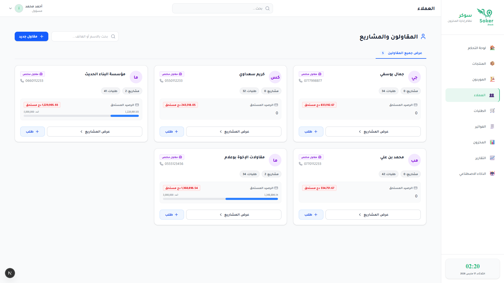
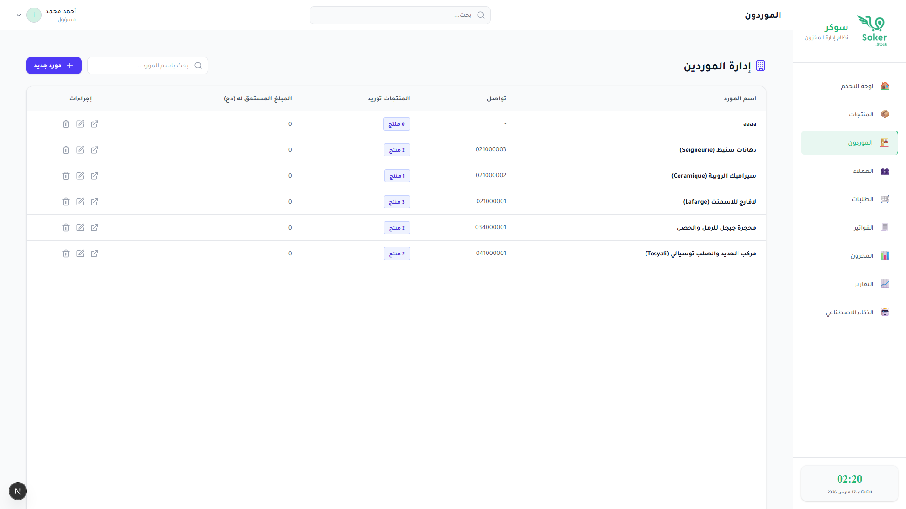
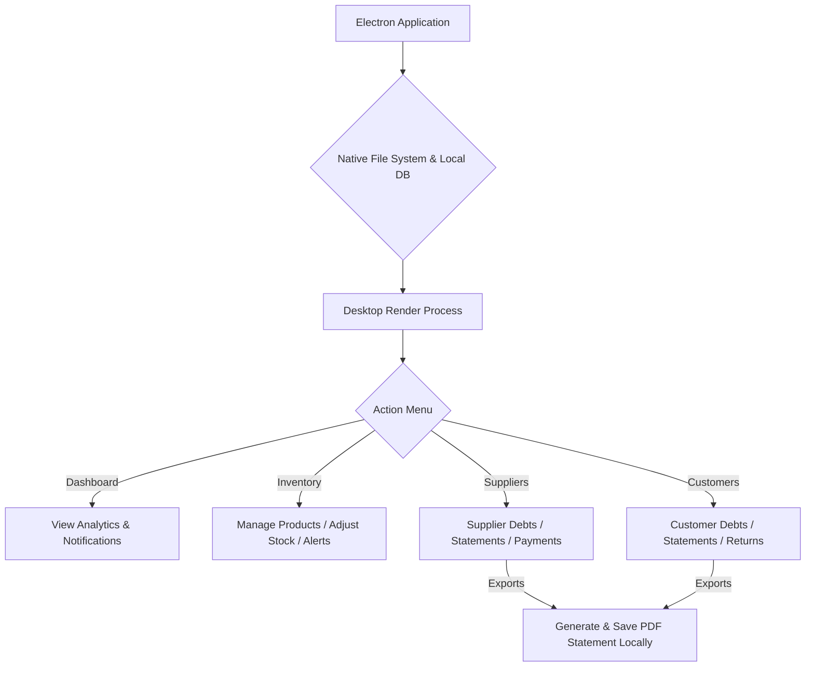

<div align="center">

# 📦 SKRStock - Ultimate Inventory & Business Management

### *A premium, comprehensive Desktop Management platform for building materials, suppliers, and customers*

[](https://electronjs.org/)
[](https://nextjs.org/)
[](https://react.dev/)
[](https://tailwindcss.com/)
[](https://prisma.io/)

</div>

---

## 📋 Overview

> **SKRStock** (formerly *Makhzoun*) is a modern, high-performance **Desktop application** designed to streamline inventory, customer, and supplier management for building material businesses. Built robustly with **Electron** and **Next.js**, SKRStock works as a standalone desktop entity, allowing businesses to track stock securely, handle debts natively, and generate professional PDF statements seamlessly right on their desktop environment.

<br>

### ✨ Key Features

<table>
<tr>
<td width="50%">

**🏢 Inventory Management**
<br>Dynamic tracking of building materials, stock levels, and product categories natively.

**👥 Comprehensive CRM**
<br>Dedicated management modules for both Customers and Suppliers.

**💰 Debt & Invoice Tracking**
<br>Detailed history of past invoices, payments, returns, and outstanding debts.

</td>
<td width="50%">

**📄 Professional PDF Exports**
<br>Generate and export comprehensive financial statements using jsPDF.

**📊 Interactive Dashboard**
<br>Clear, visual insights into business performance powered by Recharts.

**⚡ Desktop Native (Electron)**
<br>Blazing-fast desktop experience running completely standalone.

</td>
</tr>
</table>

---

## 📸 Platform Previews

<div align="center">

### Interactive Dashboard & Inventory



### Customer & Supplier Management


</div>

---

## 🚀 Quick Start

### Prerequisites

```
✓ Node.js 20.x or higher
✓ npm package manager (or yarn/pnpm)
```

### Installation

<details open>
<summary><b>📦 Step-by-Step Setup</b></summary>

<br>

**1️⃣ Clone the repository**
```bash
git clone https://github.com/Islamroubache/SKRStock.git
cd SKRStock
```

**2️⃣ Install dependencies**
```bash
npm install
```

**3️⃣ Set up your environment variables**
Create a `.env` file referencing your local database configuration.
```bash
cp .env.example .env
```

**4️⃣ Seed the Database (Optional)**
```bash
npm run db:seed
```

**5️⃣ Run the Desktop Application**
```bash
npm run dev
# For production build: npm run build
```

The Electron container will initialize and launch the SKRStock application natively on your desktop!

</details>

---

## 🛠️ Technology Stack

<div align="center">

| Category | Technologies |
|:---------|:-------------|
| **Executable** |  Native Desktop Engine |
| **Framework** |  App Router |
| **Frontend** |   |
| **Styling** |  shadcn/ui components |
| **Database ORM** |  LibSQL (Turso) |
| **Data Visualization**| Recharts |
| **Document Exporting**| jsPDF & xlsx |
| **Icons** | Lucide React |

</div>

---

## 🤖 Platform Architecture

<div align="center">



</div>

---

## 🤝 Contributing

<div align="center">

**Contributions are welcome!** Please feel free to submit a Pull Request.

</div>

---

## 👥 Authors

<div align="center">

<table>
<tr>
<td align="center">
<br>
<sub><b>Islam Roubache</b></sub><br>
🎓 Master's Student in AI & Data Science<br>
📍 Higher School of Computer Science 08 May 1945<br>
Sidi Bel Abbes, Algeria
</td>
</tr>
</table>

</div>

---

## 📧 Contact

<div align="center">

**Questions or Support?**

📧 Email: [i.roubache@esi-sba.dz](mailto:i.roubache@esi-sba.dz)

💬 Open an issue for bug reports or feature requests

</div>

---

<div align="center">

### ⭐ Star this repository if you find it helpful!

<br>

**Built with resilience for intelligent inventory management**

</div>
